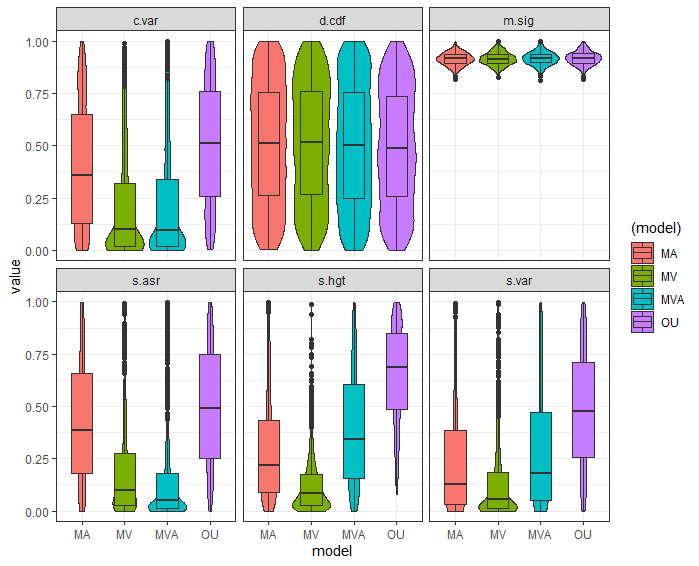

```{r setup, include=FALSE}
knitr::opts_chunk$set(echo = TRUE)
```

## Introduction

The Ornstein-Uhlenbeck model of character evolution postulates that
characters will evolve in a random walk but will be constrained by some
evolutionary optima, alpha. Brownian Motion can then be considered a
special case of OU, where the optima is 0. Alternate versions of OU
processes have been discussed in the literature, including models with
multiple evolutionary rates (OUMV), multiple adaptive optima (OUMA), and
a mixture of the two (OUMVA). By simulating OU datasets and measuring
the adequacy of each of these models to that data via the arbutus
package, I hope to gain an understanding of each of the test statistics
measured in arbutus. Measures of inadequacy for each of the alternative
models can tell me what each statistic tells me.

## Method

Simulation of phylogenetic character data was carried out via the OUwie
package. This package specializes in simulation and measurement of OU
models and variations of that model. Species trees were randomly
generated using a pure birth model via a function from the geiger
package, a package that improves and adds upon the ape package; both of
these tools are used for the analysis and handling of phylogenetic data.

Four models were tested; single rate and single optima OU (labeled as
OU), multirate OU (OUMV), multioptima OU (OUMA), and multirate
multioptima OU (OUMVA). 1000 sets of character data were simulated for
each model and measured for model adequacy via arbutus. These
calculations were carried out in Arbutus_Exploration_v2.R script.

## Results

The main figure generated from analysis and simulation is shown below.
The figure shows the distribution and probability density of p-values
for each of the 6 test statistics generated in arbutus. High p-values
suggest that the data could be represented by the model, so a high
p-value suggests better adequacy. Each of the 6 test statistics 
represents different potential violations of the data to a specific
model. Each of the models listed are the generating models, which were
then fit to a regular OU process.



### C.var
c.var, or the coefficient of variation, is calculated from the absolute
value of the contrasts. It accounts for rate heterogeneity. In the figure
above, it is lowest in OUMV and OUMVA, which makes sense, because these two
models have multiple rates, and therefore a regular OU model is not accurate.

### d.cdf
This is the D statistic, which measures deviations from normality. Because
OU data is essentially random walk, it makes sense that all models have 
approximately equal p-values for this statistic. An early burst model
would likely show low p-values. 

### m.sig
This is the mean of the squared contrasts and measures if overall evolutionary
rate is over or underestimated. Because each is essentially an OU process,
violations for this statistic are not expected and not observed. 

### s.asr
This calculations takes ancestral states into account to measure rate variation
in comparison to trait value. Because there are multiple rates in OUMV and OUMVA,
it follows that these two datasets do not fit the single rate OU model. OUMA and
regular OU do fit the model.

### s.hgt
This statistic measures trait variation relative to time. This statistic would
be better evaluated when compared to an Early Burst model. It seems like all
three alternative OU models are not adequate in this statistic, with MVA being
the best.

### s.var
This statistic measures if contrasts deviate from expected based on branch 
lengths. So if more/less evolution occured on a shorter tree than expected,
we would see a violation. It seems that only the OU data fit the OU model 
well from this measurement. I would like to see if BM and EB processes
violate this statistic as well. 

## Future exploration
From examining the test statistics, I would like to add Early Burst and 
Brownian Motion processes to this analysis. This would deepen my understanding
of what the test statistics measure and clarify how a model can be inadequate
for a specific dataset. 
