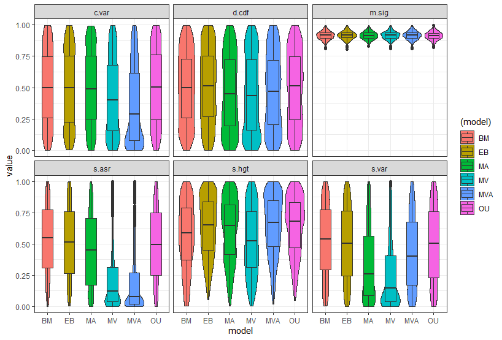
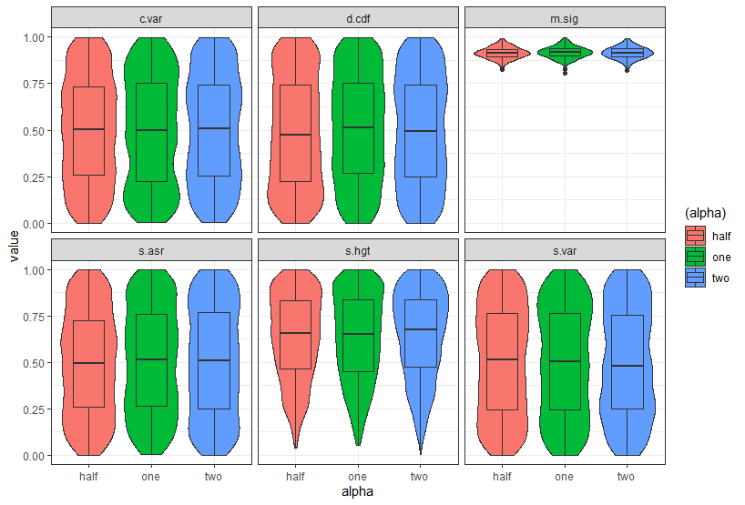
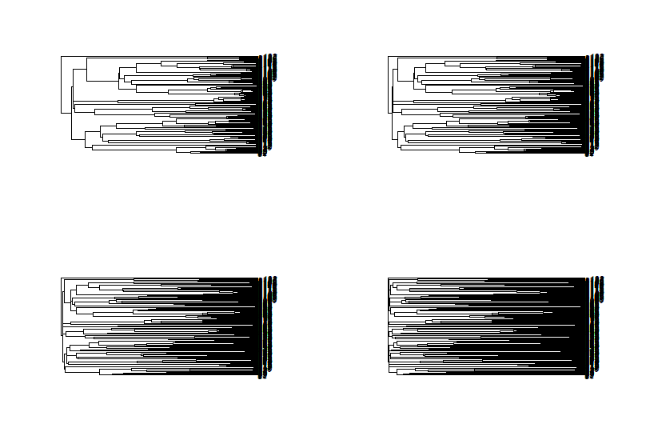
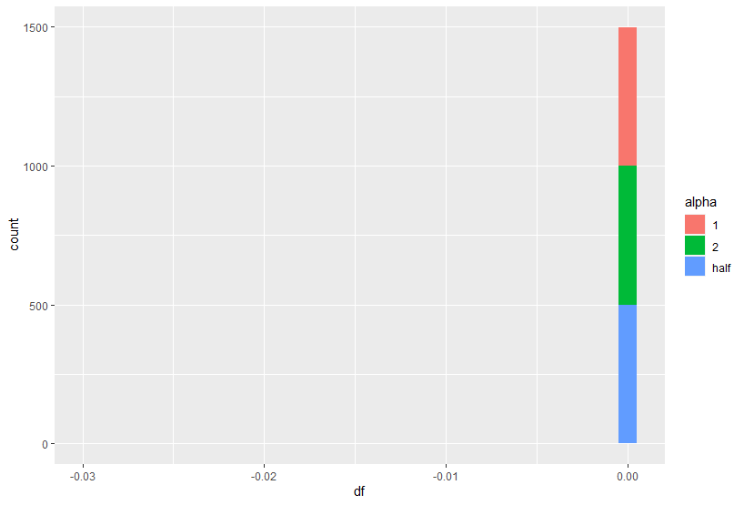
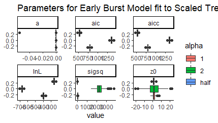

Adequacy of Alternate OU Models
================
Fiel Dimayacyac
02/11/2021

## Introduction

The Ornstein-Uhlenbeck model of character evolution postulates that
characters will evolve in a random walk but will be constrained by some
evolutionary optima, alpha. Brownian Motion can then be considered a
special case of OU, where the optima is 0. Alternate versions of OU
processes have been discussed in the literature, including models with
multiple evolutionary rates (OUMV), multiple adaptive optima (OUMA), and
a mixture of the two (OUMVA). By simulating OU datasets and measuring
the adequacy of each of these models to that data via the arbutus
package, I hope to gain an understanding of each of the test statistics
measured in arbutus. Measures of inadequacy for each of the alternative
models can tell me what each statistic tells me.

## Method

Simulation of phylogenetic character data was carried out via the OUwie
package. This package specializes in simulation and measurement of OU
models and variations of that model. Species trees were randomly
generated using a pure birth model via a function from the geiger
package, a package that improves and adds upon the ape package; both of
these tools are used for the analysis and handling of phylogenetic data.

Five models were tested; single rate BM, single rate and single optima
OU (labeled as OU), multirate OU (OUMV), multioptima OU (OUMA), and
multirate multioptima OU (OUMVA). 1000 sets of character data were
simulated for each model and measured for model adequacy via arbutus.
These calculations were carried out in Arbutus\_Exploration\_v2.R
script.

## Results

The main figure generated from analysis and simulation is shown below.
The figure shows the distribution and probability density of p-values
for each of the 6 test statistics generated in arbutus. High p-values
suggest that the data could be represented by the model, so a high
p-value suggests better adequacy. Each of the 6 test statistics
represents different potential violations of the data to a specific
model. Each of the models listed are the generating models, which were
then fit to a regular OU process.

### C.var

c.var, or the coefficient of variation, is calculated from the absolute
value of the contrasts. It accounts for rate heterogeneity. In the
figure above, it is lowest in OUMV and OUMVA, which makes sense, because
these two models have multiple rates, and therefore a regular OU model
is not accurate.

### d.cdf

This is the D statistic, which measures deviations from normality.
Because OU data is essentially random walk, it makes sense that all
models have approximately equal p-values for this statistic.

### m.sig

This is the mean of the squared contrasts and measures if overall
evolutionary rate is over or underestimated. Because each is essentially
an OU process, violations for this statistic are not expected and not
observed. It would be interesting to see this statistic when the
parameter estimates deviate from the actual parameter values.

### s.asr

This calculations takes ancestral states into account to measure rate
variation in comparison to trait value. Because there are multiple rates
in OUMV and OUMVA, it follows that these two datasets do not fit the
single rate OU model. OUMA and regular OU do fit the model.

### s.hgt

This statistic measures trait variation relative to time. This statistic
would be better evaluated when compared to an Early Burst model. It
seems like all three alternative OU models are not adequate in this
statistic, with MVA being the best.

### s.var

This statistic measures if contrasts deviate from expected based on
branch lengths. So if more/less evolution occured on a shorter tree than
expected, we would see a violation. It seems that only the OU data fit
the OU model well from this measurement.

## Future exploration of Early Burst

From examining the test statistics, I would like to re-analyze the Early
Burst simulation data further. So far, I have looked at how Early
Burst’s alpha parameter influences these t-statistics. The results are
shown below.

As shown in the plot, changing the alpha parameter does not seem to have
an effect on the t-statistics. Also, as in the composite violin plot,
Early Burst models seem to very closely resemble Brownian Motion violin
plots, even for s.hgt, which should account for the rate varying over
time, and thus, the Early Burst Model. This may be an artifact from how
the EB simulations are run, and so I will analyze that next.

## EB Simulations

Simulating Early Burst models requires the rescaling of a tree, followed
by fitting to a Brownian Motion model. The rescaling should account for
the “slowing down” of the evolutionary rate. I first simulated a
pure-birth phylogenetic tree of 128 species, followed by rescaling the
tree with different alpha parameters. The alpha parameter represents the
strength of the EB process, i.e., how much the evolutionary rate slows
down. The original tree and the scaled trees are shown below.

Top left represents the original tree, while top right, bottom left, and
bottom right are an alpha of half, one, and two respectively.

Tree rescaling seems to be working correctly as increasing alpha causes
the tree to become increasingly lengthened.

I then used fitContinuous() from the geiger package to examine estimated
parameters and compare to those used to generate the data. The graph
below shows the estimate for the alpha parameter (500 replicates for
each alpha value).
 As shown in the
graph above, an alpha value of 0 was estimated for alphas of each of the
three values! This suggests issues with fitting of the data to the
rescaled trees. Other parameters from the fit are as shown below.

 As shown in the plot
above, alpha values for the scaled tree affect estimates for rate, as
well as AIC values.
