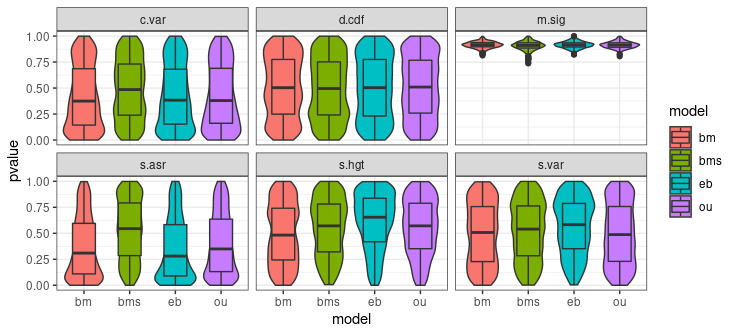
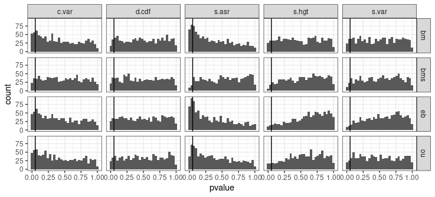

# Analysis of Multirate Models

------------------------------------------------------------------------

## Introduction

In this analysis I will use simulations to understand which inadequacies
will appear when fitting various models when the true model is a BMS
(Multiple rate Brownian Motion model). Recently, I have implemented the
usage of BMS models into arbutus by adding compatibility with OUwie
objects (from the OUwie package) as well as adding rescaling functions
for when multiple rates exist. Many of the data sets I am using in my
other analyses suggest that there may be branch-specific evolutionary
patterns. Therefore, it is important to recognize which test statistics
tend to be violated when the data is truly branch-specific (multi-rate
BM) but the model fits a single parameter for the whole tree, and which
test statistics are not affected.

## Methods

In these simulations I generated a pure-birth phylogenetic tree with 128
tips from which each of the simulations are based. For each run of the
simulation, I simulated a two-regime BM model so that each half of the
tree was subject to one of the evolutionary rates. After simulation of
character data, I fit each of the four models (BM, OU, EB, and BMS) and
ran arbutus analysis to generate p-values. I then plotted these p-values
per statistic, as well as per model. 1000 simulations were run.

## Results

To elucidate overall trends I first made a violin plot from the arbutus
p-values. This is shown below.

**Figure 1: Violin plot of the p-value distributions for each test
statistic per model.** M.sig shows usual behavior. S.var and s.hgt have
lower-than-expected p-values on the low end for EB. S.hgt has lower than
expected values for just s.hgt. Both c.var and s.asr have
higher-than-expected p-values on the low end for all models except for
the true model.

I then wanted to see just how many simulated data-sets were inadequate
and where, so I plotted histograms with 0.05 plotted as well as a
vertical line.

**Figure 2: Histogram of the p-value distributions for each test
statistic (columns) and models (rows).** C.var and s.asr show much
higher count of inadequate p-values for all models except for the true
model.

Next, I wanted to see the reverse; the effect of fitting a BMS model
when the true model is BM. Additionally, I want to see how AIC will
choose each model. I also want to carry out this same analysis on
multirate OU models. I also want to see the effect the number of “true”
regimes has (Each model has a different amount of true regimes, starting
with 1-3). Compare multirate BMS to multirate OU.
