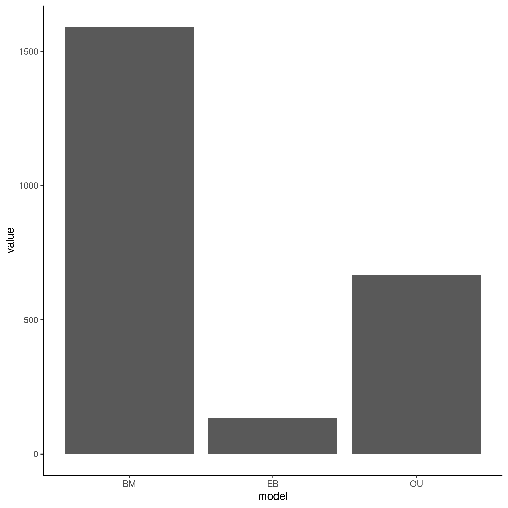
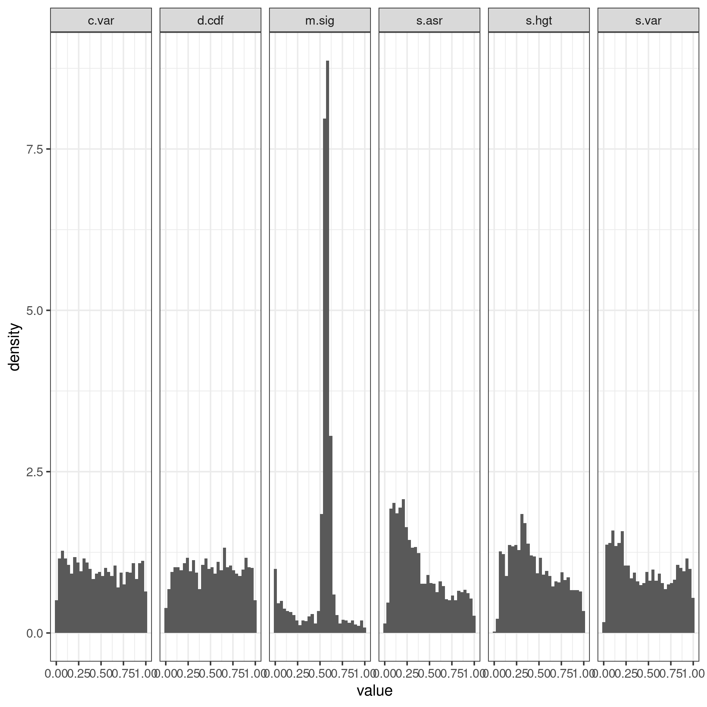
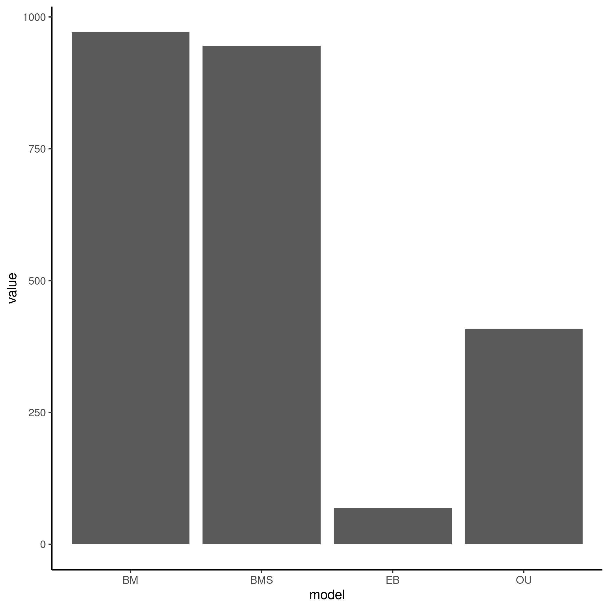

```{r setup, include=FALSE}
knitr::opts_chunk$set(echo = TRUE)
```

# Analysis of Heliconius Butterflies adequacy data

------------------------------------------------------------------------

## Introduction

The data set is taken from a [paper](https://academic.oup.com/genetics/article/213/2/581/5930581?login=true) studying gene expression data in eye and brain tissue in butterfly species by Catalan et al. The paper primarily uses two models; Brownian Motion and Ornstein-Uhlenbeck, to elucidate how much the processes of Drift and Directional Selection contribute to differences in gene expression levels between the five studied species. They found that Drift (modeled by Brownian Motion) was the dominant evolutionary process in this taxa, and specifically single-rate BM. They then studied Directional Selection by modeling "branch-shift" BM and OU, where the evolutionary rate changes among branches (also known as multi-rate BM or OU); of which they found 16% of the data can be explained in this manner. My analysis will assess how well the evolutionary models can explain the data, and if they are appropriate for this analysis.

## Summary Analysis

```{r include=FALSE}
library(tidyverse)
p_male <- readRDS("arbutus/pvals_male") %>% select(!m.sig) %>% transmute(c.less = c.var <= 0.05, sv.less = s.var <= 0.05, sa.less = s.asr <= 0.05, sh.less = s.hgt <= 0.05 & !is.na(s.hgt), d.less = d.cdf <= 0.05) %>% transmute(inade = c.less + sv.less + sa.less + sh.less + d.less) %>% count(inade) %>% mutate(prop = n/sum(n)) %>% mutate(inade = as.character(inade), sex = "male")
p_female <- readRDS("arbutus/pvals_female") %>% select(!m.sig) %>% transmute(c.less = c.var <= 0.05, sv.less = s.var <= 0.05, sa.less = s.asr <= 0.05, sh.less = s.hgt <= 0.05 & !is.na(s.hgt), d.less = d.cdf <= 0.05) %>% transmute(inade = c.less + sv.less + sa.less + sh.less + d.less) %>% count(inade) %>% mutate(prop = n/sum(n)) %>% mutate(inade = as.character(inade), sex = "female")

p_df <- full_join(p_male, p_female) 

figure1 <- p_df %>% ggplot(aes(x = inade, y = n, fill = inade)) + geom_bar(stat = "identity") + geom_text(aes(label = round(prop, digits = 2))) +
  xlab("Number of inadequacies") + ylab("Number of genes") + labs(tag = "A") + ggtitle("Amount of genes by number of inadequacies without BMS model") + facet_grid(~sex) + theme_bw() 

p_male2 <- readRDS("multirate_arbutus/pvals_male") %>% select(!m.sig) %>% transmute(c.less = c.var <= 0.05, sv.less = s.var <= 0.05, sa.less = s.asr <= 0.05, sh.less = s.hgt <= 0.05 & !is.na(s.hgt), d.less = d.cdf <= 0.05) %>% transmute(inade = c.less + sv.less + sa.less + sh.less + d.less) %>% count(inade) %>% mutate(prop = n/sum(n)) %>% mutate(inade = as.character(inade), sex = "male")

p_female2 <- readRDS("multirate_arbutus/pvals_female") %>% select(!m.sig) %>% transmute(c.less = c.var <= 0.05, sv.less = s.var <= 0.05, sa.less = s.asr <= 0.05, sh.less = s.hgt <= 0.05 & !is.na(s.hgt), d.less = d.cdf <= 0.05) %>% transmute(inade = c.less + sv.less + sa.less + sh.less + d.less) %>% count(inade) %>% mutate(prop = n/sum(n)) %>% mutate(inade = as.character(inade), sex = "female")


p_df2 <- full_join(p_male2, p_female2)

figure1b <- p_df2 %>% ggplot(aes(x = inade, y = n, fill = inade)) + geom_bar(stat = "identity") + geom_text(aes(label = round(prop, digits = 2))) +
  xlab("Number of inadequacies") + ylab("Number of genes") + labs(tag = "B") + ggtitle("Amount of genes by number of inadequacies with BMS model") + facet_grid(~sex) + theme_bw() 
```

```{r}
figure1
figure1b
```

**Figure 1: Using the best-fit model (chosen by AIC) shows a high adequacy for the data set, with only 1 or 2 inadequacies.** A) Total adequacy without including the BMS model. B) Total adequacy including the BMS model. Adequacy does not seem to change at all with including another model to the analysis.

Overall, the data set is quite adequate, with only \~19% of genes for males and \~16% of genes for females showing inadequacy. Adding a "rate shift" BM model did not seem to impact the overall data adequacy much.

## Results

### Initial Arbutus Analysis

{width="339"}

{width="308"}

**Figure 2. Relative fit (left) and absolute fit (right) of the data.** Overall, a BM model fits the data the best in a relative sense, and in an absolute sense the best-fit model is quite adequate. The only test statistics showing a meaningful inadequacy are s.asr and s.var.

After initial analysis, I hypothesized that adding a multi-rate model to the analysis would increase the fit of the data, due to inadequacies in s.asr and s.var, which were shown to have increased values under 0.05 when the true model is BMS and a single-rate model is fit in my other analysis (Analysis of Multirate models in the Arbutus Exploration folder).

{width="340"}

{width="324"}

**Figure 3. Relative fit (left) and absolute fit (right) of the data when adding a BMS model to analysis.** Much of the data fit a multi-rate BM model the best in a relative sense, however this had little affect on the adequacy patterns of the data.

As shown by Figure 1 and Figure 3, adding a BMS model to the data has little effect on overall adequacy, nor the pattern of inadequacies. Therefore, some other factors may be causing the inadequacies for this data. One such factor could be the small amount of tips in the phylogeny. This phylogeny only contains 5 species, so resolution could be quite poor, as finding the true parameters for the data when fitting to such a small tree can be quite error prone. It is possible that a multi-rate OU model could increase the data adequacy, but perhaps not for this specific data set, as overall the original paper suggested that multiple-rate models only fit 16% of the data. Another possible factor could be distance from the "true" tree for each gene. A species tree is an amalgamation of the relationships between genes, and as such has a lower resolution for each individual gene. So using a phylogeny that is not technically correct for each gene could make a data set more or less adequate than in reality. I will assess each of these possible factors in other data sets.
