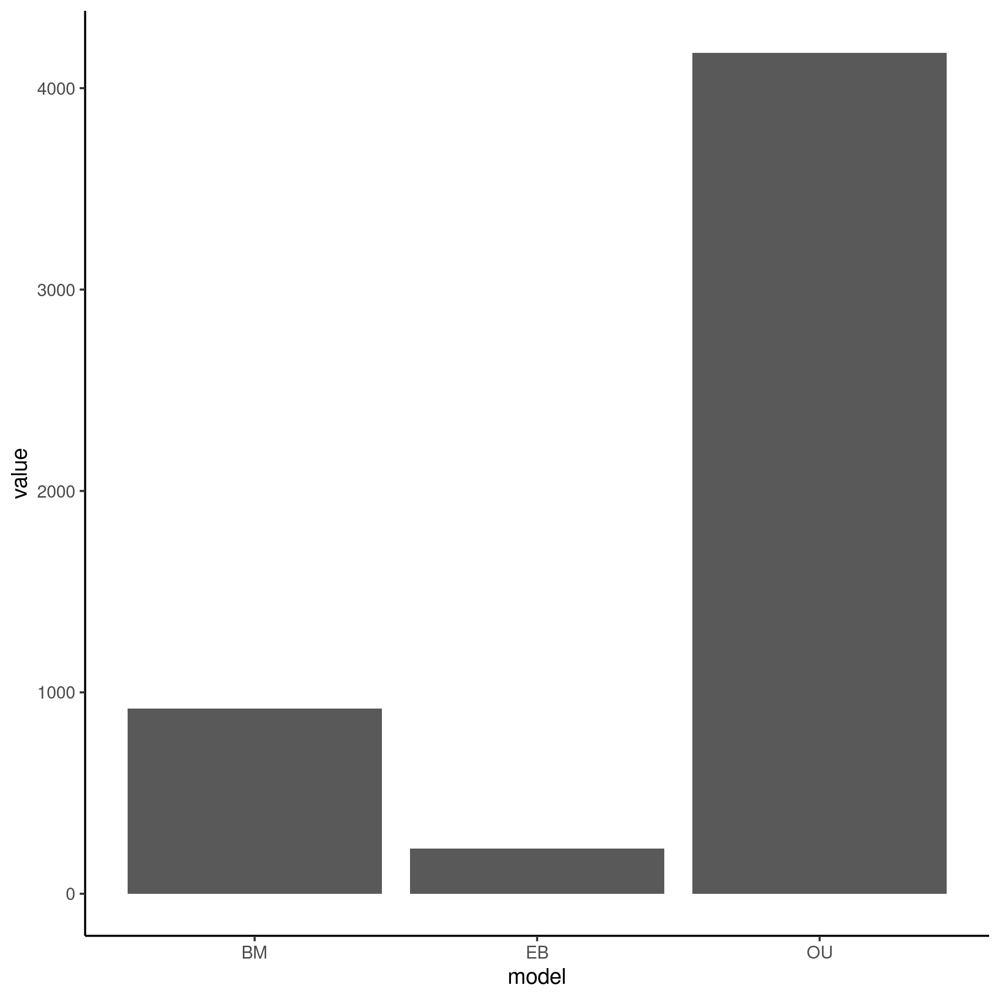
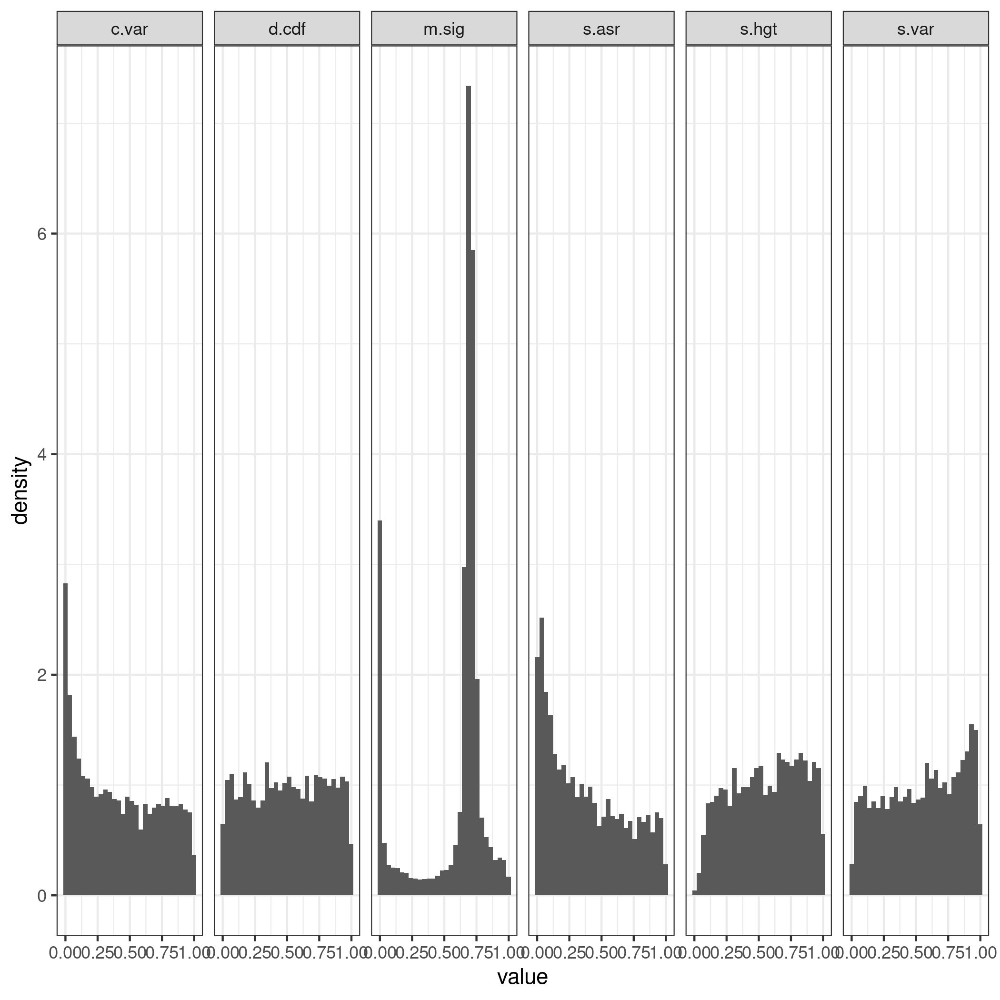

## Summary of Data Set

The data set analyzed in this directory is taken from a study on gene expression evolution among a set of 10 species across 6 different organs. In total, they performed RNA-Seq on 5320 orthologous genes/transcripts across these species and organs. Through a hypothesis-testing framework, they showed that the rate of gene expression evolution varies across organs and species due to selective pressures. Specifically, they used hypothesis testing to determine that different lineages (or organs) had 1: Multiple evolutionary optima and 2: Had different evolutionary optima. In this case, the null hypothesis was an OU model, with the alternative hypothesis being a multi-optima OU model.

```{r include=FALSE}
#Code taken from summary of coevolution dataset, still need to edit.
#Summary stats for Arbutus results
library(tidyverse)
p_br <- readRDS("species_phylogeny/arbutus/pvals_br") %>% select(!m.sig) %>% transmute(c.less = c.var <= 0.05, sv.less = s.var <= 0.05, sa.less = s.asr <= 0.05, sh.less = s.hgt <= 0.05 & !is.na(s.hgt), d.less = d.cdf <= 0.05) %>% transmute(inade = c.less + sv.less + sa.less + sh.less + d.less) %>% count(inade) %>% mutate(prop = n/sum(n)) %>% mutate(inade = as.character(inade), organ = "br")
p_cb <- readRDS("species_phylogeny/arbutus/pvals_cb") %>% select(!m.sig) %>% transmute(c.less = c.var <= 0.05, sv.less = s.var <= 0.05, sa.less = s.asr <= 0.05, sh.less = s.hgt <= 0.05 & !is.na(s.hgt), d.less = d.cdf <= 0.05) %>% transmute(inade = c.less + sv.less + sa.less + sh.less + d.less) %>% count(inade) %>% mutate(prop = n/sum(n)) %>% mutate(inade = as.character(inade), organ = "cb")
p_ht <- readRDS("species_phylogeny/arbutus/pvals_ht") %>% select(!m.sig) %>% transmute(c.less = c.var <= 0.05, sv.less = s.var <= 0.05, sa.less = s.asr <= 0.05, sh.less = s.hgt <= 0.05 & !is.na(s.hgt), d.less = d.cdf <= 0.05) %>% transmute(inade = c.less + sv.less + sa.less + sh.less + d.less) %>% count(inade) %>% mutate(prop = n/sum(n)) %>% mutate(inade = as.character(inade), organ = "ht")
p_lv <- readRDS("species_phylogeny/arbutus/pvals_lv") %>% select(!m.sig) %>% transmute(c.less = c.var <= 0.05, sv.less = s.var <= 0.05, sa.less = s.asr <= 0.05, sh.less = s.hgt <= 0.05 & !is.na(s.hgt), d.less = d.cdf <= 0.05) %>% transmute(inade = c.less + sv.less + sa.less + sh.less + d.less) %>% count(inade) %>% mutate(prop = n/sum(n)) %>% mutate(inade = as.character(inade), organ = "lv")
p_kd <- readRDS("species_phylogeny/arbutus/pvals_kd") %>% select(!m.sig) %>% transmute(c.less = c.var <= 0.05, sv.less = s.var <= 0.05, sa.less = s.asr <= 0.05, sh.less = s.hgt <= 0.05 & !is.na(s.hgt), d.less = d.cdf <= 0.05) %>% transmute(inade = c.less + sv.less + sa.less + sh.less + d.less) %>% count(inade) %>% mutate(prop = n/sum(n)) %>% mutate(inade = as.character(inade), organ = "kd")


p_df <- full_join(p_br, p_cb) %>% full_join(p_ht) %>% full_join(p_kd) %>% full_join(p_lv) 

figure1 <- p_df %>% ggplot(aes(x = inade, y = n, fill = inade)) + geom_bar(stat = "identity") + geom_text(aes(label = round(prop, digits = 2))) +
  xlab("Number of inadequacies") + ylab("Number of genes") + labs(tag = "A") + ggtitle("Amount of genes by number of inadequacies using species phylogenies") + facet_grid(~organ) + theme_bw() 

p_br <- readRDS("gene_family_phylogenies/arbutus/pvals/pvals_br") %>% select(!m.sig) %>% transmute(c.less = c.var <= 0.05, sv.less = s.var <= 0.05, sa.less = s.asr <= 0.05, sh.less = s.hgt <= 0.05 & !is.na(s.hgt), d.less = d.cdf <= 0.05) %>% transmute(inade = c.less + sv.less + sa.less + sh.less + d.less) %>% count(inade) %>% mutate(prop = n/sum(n)) %>% mutate(inade = as.character(inade), organ = "br")
p_cb <- readRDS("gene_family_phylogenies/arbutus/pvals/pvals_cb") %>% select(!m.sig) %>% transmute(c.less = c.var <= 0.05, sv.less = s.var <= 0.05, sa.less = s.asr <= 0.05, sh.less = s.hgt <= 0.05 & !is.na(s.hgt), d.less = d.cdf <= 0.05) %>% transmute(inade = c.less + sv.less + sa.less + sh.less + d.less) %>% count(inade) %>% mutate(prop = n/sum(n)) %>% mutate(inade = as.character(inade), organ = "cb")
p_ht <- readRDS("gene_family_phylogenies/arbutus/pvals/pvals_ht") %>% select(!m.sig) %>% transmute(c.less = c.var <= 0.05, sv.less = s.var <= 0.05, sa.less = s.asr <= 0.05, sh.less = s.hgt <= 0.05 & !is.na(s.hgt), d.less = d.cdf <= 0.05) %>% transmute(inade = c.less + sv.less + sa.less + sh.less + d.less) %>% count(inade) %>% mutate(prop = n/sum(n)) %>% mutate(inade = as.character(inade), organ = "ht")
p_lv <- readRDS("gene_family_phylogenies/arbutus/pvals/pvals_lv") %>% select(!m.sig) %>% transmute(c.less = c.var <= 0.05, sv.less = s.var <= 0.05, sa.less = s.asr <= 0.05, sh.less = s.hgt <= 0.05 & !is.na(s.hgt), d.less = d.cdf <= 0.05) %>% transmute(inade = c.less + sv.less + sa.less + sh.less + d.less) %>% count(inade) %>% mutate(prop = n/sum(n)) %>% mutate(inade = as.character(inade), organ = "lv")
p_kd <- readRDS("gene_family_phylogenies/arbutus/pvals/pvals_kd") %>% select(!m.sig) %>% transmute(c.less = c.var <= 0.05, sv.less = s.var <= 0.05, sa.less = s.asr <= 0.05, sh.less = s.hgt <= 0.05 & !is.na(s.hgt), d.less = d.cdf <= 0.05) %>% transmute(inade = c.less + sv.less + sa.less + sh.less + d.less) %>% count(inade) %>% mutate(prop = n/sum(n)) %>% mutate(inade = as.character(inade), organ = "kd")


p_df2 <- full_join(p_br, p_cb) %>% full_join(p_ht) %>% full_join(p_kd) %>% full_join(p_lv) 

figure1b <- p_df2 %>% ggplot(aes(x = inade, y = n, fill = inade)) + geom_bar(stat = "identity") + geom_text(aes(label = round(prop, digits = 2))) +
  xlab("Number of inadequacies") + ylab("Number of genes") + labs(tag = "B") + ggtitle("Amount of genes by number of inadequacies using gene family phylogenies") + facet_grid(~organ) + theme_bw() 
```

```{r, echo=FALSE}
figure1
figure1b
```

**Figure 1.** Number of inadequacies per gene per organ. Most genes were adequate. A) Adequacy measured using species phylogeny. B) Adequacy measured using gene family phylogenies. An issue with testes data caused it to be omitted.

Overall, each organ had a similar pattern of inadequacies after full analysis. 63% or more of the genes showed no inadequacies in all organs when fitting the best-fit model, leaving 37% of genes being inadequate when fitting their best fit models. However, interestingly none of the models being tested account for multiple rates or multiple optima, which the authors of the paper heavily rely on. This may suggest that a multi-optima method may not have been necessary, but testing multi-optima OU models would be more conclusive. Furthermore, many (but still a minority) of the genes show higher relative fit for a simple BM model over OU, suggesting that perhaps even models without optima at all may be better fitting for this data set. Furthermore, comparing overall adequacy of data set was only slightly changed by substituting the species-level phylogenetic tree for gene-specific phylogenies. This caused slight decreases in the proportion of genes with no inadequate genes, and small increases across the board.

## Methods

------------------------------------------------------------------------

I first conducted a relative fit analysis via AIC to compare how well each of the 3 models (BM, OU, EB) fit the data in a relative sense. Next, I performed adequacy analysis using arbutus for the best fit model as chosen above. I then conducted the same analysis for using just BM or just OU to see how it affected adequacy of the data set. Finally, I performed the same analysis using gene-family specific phylogenies.

## Results

------------------------------------------------------------------------

After running through relative fit analysis, each of the organs showed similar patterns; i.e., that once again OU was the best fitting model most of the time, but BM models are the best-fitting almost as often as OU models are.





**Figure 2.** Relative fit (left) and absolute adequacy (right) of the best fit model for brain tissue. Other tissues show similar patterns.

As shown by the relative and absolute measures of adequacy above, OU models are relatively the best fit, but many data sets are best fit by BM. Overall, most inadequacies are in two test statistics: "c.var" and "s.asr". C.var accounts for rate heterogeneity, suggesting that a model that allows heterogeneous evolutionary rates may be more adequate. In the future, this could mean measuring the adequacy of a multirate BM model, or multirate OU model. S.asr accounts for trait variation relative to size of the trait. For example, if a gene is showing high expression, does it change a lot, or a little relative to size.

Next, I wanted to understand how many of the inadequacies in the data set are from C.var and S.asr respectively.

```{r, include=FALSE}
arbutus_summary <- function(organ, model){
  filepath <- paste0("species_phylogeny/arbutus/just", model, "/", model, "pvals_", organ)
  result <- readRDS(filepath) %>% select(!m.sig) %>%
    transmute(c.less = c.var <= 0.05, sv.less = s.var <= 0.05, sa.less = s.asr <= 0.05, sh.less = s.hgt <= 0.05 & !is.na(s.hgt),
              d.less = d.cdf <= 0.05) %>% transmute(inade = c.less + sv.less + sa.less + sh.less + d.less) %>% count(inade) %>%
    mutate(prop = n/sum(n)) %>% mutate(inade = as.character(inade), organ = organ)
  result
}
OU1 <- arbutus_summary("br", "OU")
OU2 <- arbutus_summary("cb", "OU")
OU3 <- arbutus_summary("ht", "OU")
OU4 <- arbutus_summary("kd", "OU")
OU5 <- arbutus_summary("lv", "OU")

OU_df <- full_join(OU1, OU2) %>% full_join(OU3) %>% full_join(OU4) %>% full_join(OU5) 

BM1 <- arbutus_summary("br", "BM")
BM2 <- arbutus_summary("cb", "BM")
BM3 <- arbutus_summary("ht", "BM")
BM4 <- arbutus_summary("kd", "BM")
BM5 <- arbutus_summary("lv", "BM")

BM_df <- full_join(BM1, BM2) %>% full_join(BM3) %>% full_join(BM4) %>% full_join(BM5) 

OU_df %>% ggplot(aes(x = inade, y = n, fill = inade)) + geom_bar(stat = "identity") + 
  xlab("Number of inadequacies") + ylab("Number of genes") + ggtitle("Amount of genes by number of inadequacies for OU") + facet_grid(~organ) + theme_bw()

BM_df %>% ggplot(aes(x = inade, y = n, fill = inade)) + geom_bar(stat = "identity") + 
  xlab("Number of inadequacies") + ylab("Number of genes") + ggtitle("Amount of genes by number of inadequacies for BM") + facet_grid(~organ) + theme_bw()

p_fuse <- p_df %>% mutate(model = "best")
BM_fuse <- BM_df %>% mutate(model = "BM")
fused_df <- OU_df %>% mutate(model = "OU") %>% full_join(p_fuse) %>% full_join(BM_fuse)
figure4 <- fused_df %>% filter(inade == 0) %>% ggplot(aes(x = model, y = prop, fill = model)) + geom_bar(stat = "identity") + 
  xlab("Model") + ylab("Proportion of adequate genes") + ggtitle("Proportion of adequate genes when fitting different models") + 
  facet_grid(~organ) + theme_bw() + geom_text(aes(label = paste0(round(prop*100, 1), "%")), position = position_dodge(0.9), angle = 90)
```

```{r, include=FALSE}
pvals_br <- readRDS("species_phylogeny/arbutus/pvals_br")
test <- pvals_br %>% select(!m.sig) %>% drop_na() %>%
  transmute(c.var = c.var <= 0.05, s.var = s.var <= 0.05,
              s.asr = s.asr <= 0.05, s.hgt = s.hgt <= 0.05 & !is.na(s.hgt),
              d.cdf = d.cdf <= 0.05) %>% drop_na() %>% summarise(across(.fns = ~sum(.x, na.rm = TRUE))) 

figure3 <- test %>% pivot_longer(cols = everything(), names_to = "test statistic") %>% 
  ggplot(aes(x = `test statistic`, y = value/sum(value), fill = `test statistic`)) + geom_col() + geom_text(aes(label = round(value/sum(value), digits = 2))) + ylab("Percent of inadequacies") + theme_bw()

#Of the 1631 inadequacies, s.asr and c.var account for 1294 of them
```

```{r, echo=FALSE}
figure3
```

**Figure 3.** Proportion of inadequacies belonging to each test statistic for brain data. C.var was responsible for most of the inadequacies.

As shown by the plot above, c.var and s.asr account for almost 80% of the inadequacies. This means that finding a model that addresses both of these factors is imperative.

Finally, due to BM data sets showing a relatively high count of genes in which it is the best fit model, I wanted to compare the absolute adequacy of fitting purely BM, OU, or best fit models and see how important the evolutionary optima and alpha parameters are for this dataset.

```{r}
figure4
```

**Figure 4.** Proportion of adequate genes from fitting each model to the data, by organ.

As shown by the figure above, BM models lose large amounts of adequacy, even though they represent the best fit model for a large portion of data sets. Interestingly, OU models do not lose much adequacy compared to best-fit models, suggesting that even when the BM model is the best-fit, the OU model is good enough most of the time. Overall this shows the importance of the optima and constraint parameters of the OU model.

Next I wanted to compare the differences in adequacy trends for the different test statistics when comparing usage of a species phylogenetic tree to gene-specific phylogenies. Specifically, I wanted to understand if gene-specific phylogenetic trees had a higher resolution for any trends in data, that species phylogenetic trees did not allow for. It was noted for the expression coevolution data between fungi that the data was mostly adequate, and I wanted to see if that was because of usage of a species-level phylogenetic tree, compared to the comparative expression data set, which used a gene-level phylogenetic tree.

```{r, include=FALSE}
pvals_br <- readRDS("gene_family_phylogenies/arbutus/pvals/pvals_br")
test <- pvals_br %>% select(!m.sig) %>% drop_na() %>%
  transmute(c.var = c.var <= 0.05, s.var = s.var <= 0.05,
              s.asr = s.asr <= 0.05, s.hgt = s.hgt <= 0.05 & !is.na(s.hgt),
              d.cdf = d.cdf <= 0.05) %>% drop_na() %>% summarise(across(.fns = ~sum(.x, na.rm = TRUE))) 

figure5 <- test %>% pivot_longer(cols = everything(), names_to = "test statistic") %>% 
  ggplot(aes(x = `test statistic`, y = value/sum(value), fill = `test statistic`)) + geom_col() + geom_text(aes(label = round(value/sum(value), digits = 2))) + ylab("Percent of inadequacies") + theme_bw()
```

```{r}
figure5
```

**Figure 5.** Proportion of inadequacies belonging to each test statistic for gene family brain data. Inadequacies seemed to be relatively evenly spread between the statistics.

An interesting finding was that for gene-specific phylogenetic trees, inadequacies can be attributed to multiple test statistics, and not just violations from C.var or S.asr. This may suggest that the different phylogenetic topologies that are analyzed when using gene-specific trees allow for violations in multiple different ways, rather than in one or two. Perhaps more interesting is the fact that these differences in attributions of violations lead to very little, if any, difference in overall inadequacy of the model for the data set.

One specific part of this figure that may be misleading is that 25% of the inadequacies can now be attributed to S.hgt, from 2% when using a species phylogenetic tree. However, this may actually be due to higher phylogenetic signal allowed when using higher-resolution trees.

```{r s.hgt, include=FALSE}
br_spec <- readRDS("species_phylogeny/arbutus/pvals_br") %>%
  select(s.hgt) %>% mutate(data = "species")
br_gene <- readRDS("gene_family_phylogenies/arbutus/pvals/pvals_br") %>%
  select(s.hgt) %>% mutate(data = "gene family")
br <- full_join(br_spec, br_gene)

figure6a <- br %>%
  ggplot(aes(x = s.hgt, fill = data)) + geom_histogram() + facet_wrap(~data) + theme_bw() + xlab("p value") + ggtitle("P value distribution of S.hgt for brain data") + labs(tag = "A")

figure6b <- br %>% group_by(data) %>%
  summarise(NAs = sum(is.na(s.hgt)), not_NA = (n() - sum(is.na(s.hgt)))) %>%
  pivot_longer(cols = -data, names_to = "value", values_to = "count") %>%
  ggplot(aes(x = value, y = count, fill = data)) + geom_col(position = "dodge") +
  ggtitle("Number of NA values for each data set") + theme_bw() + labs(tag = "B")
```

```{r}
figure6a
figure6b
```

**Figure 6.** Comparison of S.hgt for brain data between gene family and species phylogenetic tree. A) Distribution of p values for S.hgt test statistic. Gene family phylogenies show higher number of counts near lower end. B) Number of NA vs non-NA values for each data set. Gene family trees show lower proportion of values being NA.

```{r phylosig, include=FALSE}
library(phytools)
library(ape)
library(geiger)
library(tidyverse)
library(flipR)

final_trees <- readRDS("gene_family_phylogenies/genefamilytrees")
br_avg_dat <- readRDS("species_phylogeny/br_avg_dat")
br_avg_dat <- br_avg_dat %>% filter(Gene %in% names(final_trees))
species_phylo <- read.tree(file = "species_phylogeny/species_names.nwk")
species_phylo$tip.label <- gsub("_", " ", species_phylo$tip.label)

standard_error <- function(x) sd(x) / sqrt(length(x))


format_expr_data <- function (avgdat) {
  temp <- avgdat %>% pull(Gene)
  avgdat <- avgdat %>% ungroup() %>% select(!Gene)
  dat <- flip(avgdat)
  colnames(dat) <- temp
  res <- dat %>% as.matrix()
  res
}

#remove all zeroes
br_dat <- br_avg_dat %>% format_expr_data

br_SE <- br_dat %>% as.data.frame() %>%
  rownames_to_column("Species") %>%
  group_by(Species) %>%
  summarise(Species, SE = standard_error(across(ENSG00000100364:ENSG00000170946))) %>% column_to_rownames("Species") %>% as.matrix()

br_SE <- br_SE[rownames(br_dat),]

run_phylosig <- function (phy) {
  sig_results <- vector("list", length = ncol(br_test))
  for(i in 1:length(sig_results)){
    res <- phylosig(phy, br_test[,i], method = "K", test = TRUE, se = br_SE)
    sig_results[[i]] <- res
  }
  sig_results
}

run_phylosig_gf <- function (phy_list) {
  sig_results <- vector("list", length = ncol(br_test))
  for(i in 1:length(sig_results)){
    res <- NA
    tdf <- treedata(phy_list[[i]], br_test[,i])
    if(all_zero(tdf$data[,1])){
      res <- phylosig(tdf$phy, tdf$data[,1], method = "K", test = TRUE, se = br_SE)
    }
    sig_results[[i]] <- res
  }
  sig_results
}

all_zero <- function (named_vec) {
  res <- ifelse(sum(named_vec) > 0, TRUE, FALSE)
  res
}

br_ind <- vector(mode = "logical", length = ncol(br_dat))
for(i in 1:ncol(br_dat)){
  br_ind[i] <- all_zero(br_dat[,i])
}

br_test <- br_dat[,which(br_ind)]

br_species <- run_phylosig(species_phylo)
br_genefams <- run_phylosig_gf(final_trees)
br_genefams <- br_genefams[which(!is.na(br_genefams))]

get_K_and_P <- function (sig) {
  K <- sig$K
  P <- sig$P
  list("K" = K, "P-value" = P)
}

species_vals <- map_df(br_species, get_K_and_P) %>% mutate(subset = "species")
genefams_vals <- map_df(br_genefams, get_K_and_P) %>% mutate(subset = "genefams")

K_P_vals <- bind_rows(species_vals, genefams_vals) %>% pivot_longer(cols = c(K, `P-value`), names_to = "Statistic")

figure7 <- K_P_vals %>%
  ggplot(aes(x = subset, y = value, fill = subset)) + geom_violin() + 
  geom_boxplot() + facet_wrap(~Statistic, scales = "free") + theme_bw() + ggtitle("Phylogenetic signal of all genes")+
  xlab("Subset of data")

```

```{r figure7}
figure7
```

**Figure 7.** Measures of phylogenetic signal for data using gene family trees vs species trees. Using the K-statistic, a higher proportion of genes were close to the expectations of a BM model for gene family phylogenies over species phylogenies. However, more genes showed phylogenetic significance for species trees over gene trees.

While using species trees produces more NA values for the S.hgt statistic than gene trees, less genes overall are found to have phylogenetic significance for gene trees. This may suggest that the lower-resolution species trees may be producing false positive signal. Alternatively, this may actually just show that using gene phylogenies causes data to have more BM-like properties

## Conclusion

------------------------------------------------------------------------

Analysis of this data set reveals that none of the 3 used models (BM, OU, or EB) were fully adequate for the data for any of the organs, but that OU model is mostly good. An improvement over the OU model would then be an OU model with multiple rates, and perhaps multiple optima, as shown by the inadequacies in specifically c.var and s.asr.
