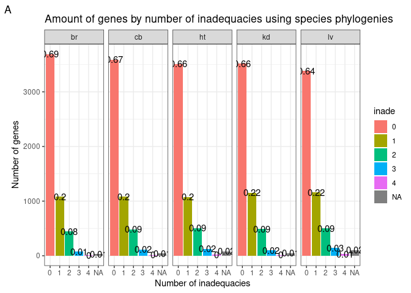
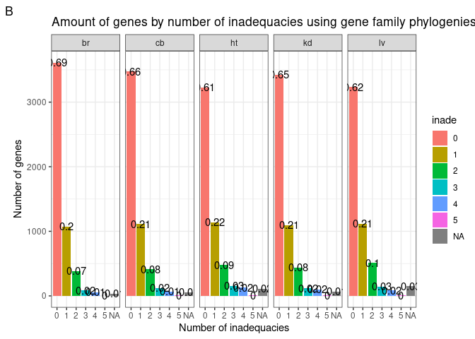
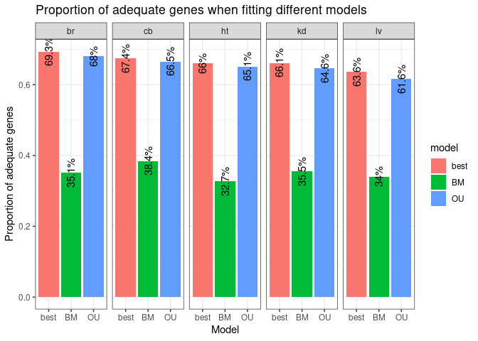
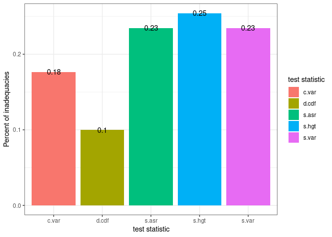
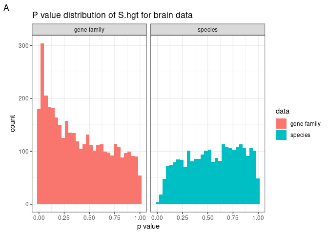
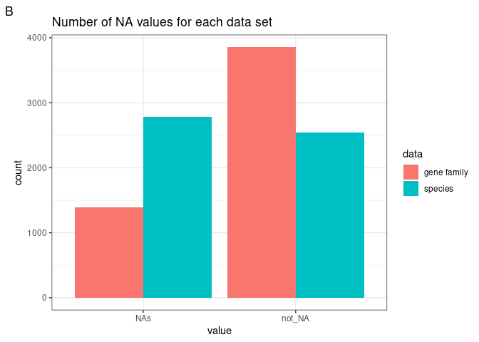
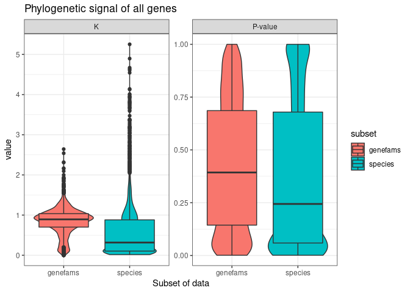

Analysis
================
Fiel Dimayacyac

## Summary of Data Set

The data set analyzed in this directory is taken from a study on gene
expression evolution among a set of 10 species across 6 different
organs. In total, they performed RNA-Seq on 5320 orthologous
genes/transcripts across these species and organs. Through a
hypothesis-testing framework, they showed that the rate of gene
expression evolution varies across organs and species due to selective
pressures. Specifically, they used hypothesis testing to determine that
different lineages (or organs) had 1: Multiple evolutionary optima and
2: Had different evolutionary optima. In this case, the null hypothesis
was an OU model, with the alternative hypothesis being a multi-optima OU
model.

<!-- --><!-- -->

**Figure 1.** Number of inadequacies per gene per organ. Most genes were
adequate. A) Adequacy measured using species phylogeny. B) Adequacy
measured using gene family phylogenies. An issue with testes data caused
it to be omitted.

Overall, each organ had a similar pattern of inadequacies after full
analysis. 63% or more of the genes showed no inadequacies in all organs
when fitting the best-fit model, leaving 37% of genes being inadequate
when fitting their best fit models. However, interestingly none of the
models being tested account for multiple rates or multiple optima, which
the authors of the paper heavily rely on. This may suggest that a
multi-optima method may not have been necessary, but testing
multi-optima OU models would be more conclusive. Furthermore, many (but
still a minority) of the genes show higher relative fit for a simple BM
model over OU, suggesting that perhaps even models without optima at all
may be better fitting for this data set. Furthermore, comparing overall
adequacy of data set was only slightly changed by substituting the
species-level phylogenetic tree for gene-specific phylogenies. This
caused slight decreases in the proportion of genes with no inadequate
genes, and small increases across the board.

## Methods

------------------------------------------------------------------------

I first conducted a relative fit analysis via AIC to compare how well
each of the 3 models (BM, OU, EB) fit the data in a relative sense.
Next, I performed adequacy analysis using arbutus for the best fit model
as chosen above. I then conducted the same analysis for using just BM or
just OU to see how it affected adequacy of the data set. Finally, I
performed the same analysis using gene-family specific phylogenies.

## Results

------------------------------------------------------------------------

After running through relative fit analysis, each of the organs showed
similar patterns; i.e., that once again OU was the best fitting model
most of the time, but BM models are the best-fitting almost as often as
OU models are.


**Figure 2.** Relative fit (left) and absolute adequacy (right) of the
best fit model for brain tissue. Other tissues show similar patterns.

As shown by the relative and absolute measures of adequacy above, OU
models are relatively the best fit, but many data sets are best fit by
BM. Overall, most inadequacies are in two test statistics: “c.var” and
“s.asr”. C.var accounts for rate heterogeneity, suggesting that a model
that allows heterogeneous evolutionary rates may be more adequate. In
the future, this could mean measuring the adequacy of a multirate BM
model, or multirate OU model. S.asr accounts for trait variation
relative to size of the trait. For example, if a gene is showing high
expression, does it change a lot, or a little relative to size.

Next, I wanted to understand how many of the inadequacies in the data
set are from C.var and S.asr respectively.

<!-- -->

**Figure 3.** Proportion of inadequacies belonging to each test
statistic for brain data. C.var was responsible for most of the
inadequacies.

As shown by the plot above, c.var and s.asr account for almost 80% of
the inadequacies. This means that finding a model that addresses both of
these factors is imperative.

Finally, due to BM data sets showing a relatively high count of genes in
which it is the best fit model, I wanted to compare the absolute
adequacy of fitting purely BM, OU, or best fit models and see how
important the evolutionary optima and alpha parameters are for this
dataset.

``` r
figure4
```

<!-- -->

**Figure 4.** Proportion of adequate genes from fitting each model to
the data, by organ.

As shown by the figure above, BM models lose large amounts of adequacy,
even though they represent the best fit model for a large portion of
data sets. Interestingly, OU models do not lose much adequacy compared
to best-fit models, suggesting that even when the BM model is the
best-fit, the OU model is good enough most of the time. Overall this
shows the importance of the optima and constraint parameters of the OU
model.

Next I wanted to compare the differences in adequacy trends for the
different test statistics when comparing usage of a species phylogenetic
tree to gene-specific phylogenies. Specifically, I wanted to understand
if gene-specific phylogenetic trees had a higher resolution for any
trends in data, that species phylogenetic trees did not allow for. It
was noted for the expression coevolution data between fungi that the
data was mostly adequate, and I wanted to see if that was because of
usage of a species-level phylogenetic tree, compared to the comparative
expression data set, which used a gene-level phylogenetic tree.

``` r
figure5
```

<!-- -->

**Figure 5.** Proportion of inadequacies belonging to each test
statistic for gene family brain data. Inadequacies seemed to be
relatively evenly spread between the statistics.

An interesting finding was that for gene-specific phylogenetic trees,
inadequacies can be attributed to multiple test statistics, and not just
violations from C.var or S.asr. This may suggest that the different
phylogenetic topologies that are analyzed when using gene-specific trees
allow for violations in multiple different ways, rather than in one or
two. Perhaps more interesting is the fact that these differences in
attributions of violations lead to very little, if any, difference in
overall inadequacy of the model for the data set.

One specific part of this figure that may be misleading is that 25% of
the inadequacies can now be attributed to S.hgt, from 2% when using a
species phylogenetic tree. However, this may actually be due to higher
phylogenetic signal allowed when using higher-resolution trees.

``` r
figure6a
```

    ## `stat_bin()` using `bins = 30`. Pick better value with `binwidth`.

    ## Warning: Removed 4171 rows containing non-finite values (stat_bin).

<!-- -->

``` r
figure6b
```

<!-- -->

**Figure 6.** Comparison of S.hgt for brain data between gene family and
species phylogenetic tree. A) Distribution of p values for S.hgt test
statistic. Gene family phylogenies show higher number of counts near
lower end. B) Number of NA vs non-NA values for each data set. Gene
family trees show lower proportion of values being NA.

``` r
figure7
```

<!-- -->

**Figure 7.** Measures of phylogenetic signal for data using gene family
trees vs species trees. Using the K-statistic, a higher proportion of
genes were close to the expectations of a BM model for gene family
phylogenies over species phylogenies. However, more genes showed
phylogenetic significance for species trees over gene trees.

While using species trees produces more NA values for the S.hgt
statistic than gene trees, less genes overall are found to have
phylogenetic significance for gene trees. This may suggest that the
lower-resolution species trees may be producing false positive signal.
Alternatively, this may actually just show that using gene phylogenies
causes data to have more BM-like properties

## Conclusion

------------------------------------------------------------------------

Analysis of this data set reveals that none of the 3 used models (BM,
OU, or EB) were fully adequate for the data for any of the organs, but
that OU model is mostly good. An improvement over the OU model would
then be an OU model with multiple rates, and perhaps multiple optima, as
shown by the inadequacies in specifically c.var and s.asr.
