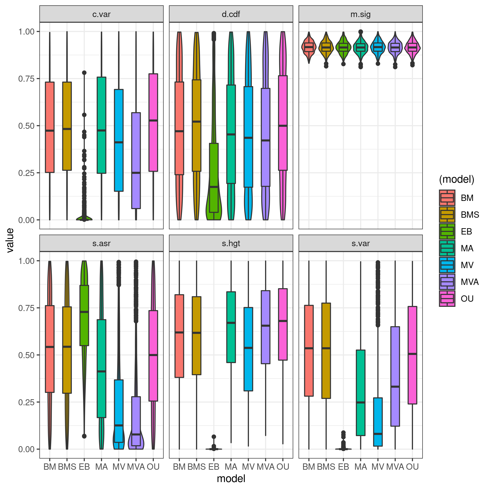
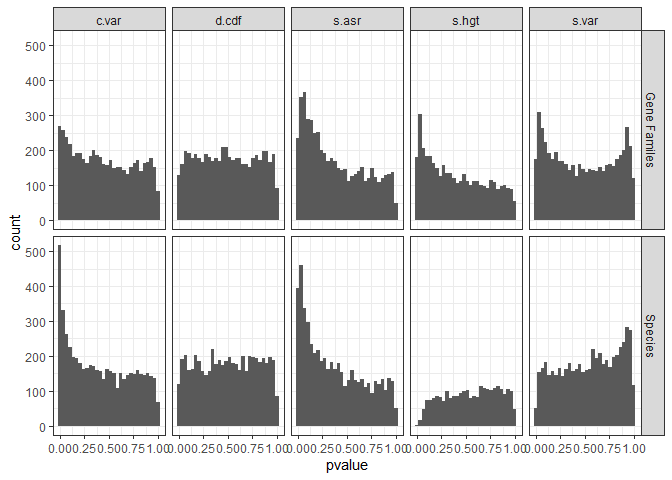

# Analysis of the Adequacy of Widely Used Phylogenetic Models in Gene Expression Data

------------------------------------------------------------------------

## Introduction

The analyses in this document were run on 9 different gene expression
data sets, outlined in the README file in this repository. These data
sets are of hundreds of different species and tens of thousands of
different genes. Some analyses were run using the species-level
phylogeny, while others were run using individual gene-level
phylogenies. The models interrogated in this analysis include the
Brownian Motion model depicting random walk of a character trait, the
Ornstein-Uhlenbeck model depicting random walk with a constraint value,
and the Early Burst model depicting random walk with a slowing down of
evolutionary rate as time passes. A fourth model is added, Brownian
Motion with multiple rates, that allows different branches of the tree
to have separate evolutionary rate parameters but is otherwise Brownian
Motion. In the literature, each of these models is often used as a
stand-in of an evolutionary process; Brownian Motion as neutral drift,
Ornstein-Uhlenbeck as stabilizing selection, and Early Burst as adaptive
radiation. The selection of a model as the “dominant model” through
various model-selection processes is then often used to state that
stabilizing selection is the dominant mode of evolution for some set of
genes for example. Rather than make specific claims about the results of
each paper, this analysis aims to understand and highlight patterns of
model adequacy in the field; i.e., do the models we are using actually
describe the variation in the data? Or is there much left to be desired?

## Summary

By using the Akaike Information Criterion to measure relative fit, I
show that broadly, the Ornstein-Uhlenbeck model is the best fit for most
of the data; i.e., the model with the lowest AIC for each gene is most
often OU by a fair margin. In the absolute sense, most of the data was
adequately modeled by the best-fit model (most commonly OU), but these
models were very often inadequate in terms of rate heterogeneity. I then
ran simulations to show that processes that truly had multiple rate
parameters would violate the same test statistics as seen in the data.
To solve this I then added a fourth model to the analysis; multi-rate
Brownian Motion. In a relative sense, addition of the model then shifted
the domination to this multirate BM so that most of the data was
best-fit by a multi-rate model. In an absolute sense, it did somewhat
reduce issues with rate heterogeneity, but other issues still persist.
All in all, it seems that in general, rate heterogeneity is not being
accounted for in the most commonly used models of evolution in the
field, and usage of those types of models would improve data capture.

## Data used in this analysis

| Data set                      | Number of Genes | Number of Species |
|-------------------------------|-----------------|-------------------|
| cichlids                      | 32,596          | 73                |
| fishes                        | 16,740          | 20                |
| Heliconius\_Butterflies       | 2,393           | 5                 |
| Mammal\_organs                | 5,320           | 10                |
| snakes                        | 11              | 52                |
| comparative\_expression\_2017 | 8,333           | 9                 |
| GeneExpression\_coevolution   | 3,556           | 18                |
| interspecific\_rnaseq         | 3,560           | 14                |
| amalgam data                  | 1,377           | 21                |

## Simulations Illustrate Expected Inadequacy Patterns

To visualize patterns I expect to see when data is adequate or
inadequate, I first performed a set of simulations. In these
simulations, the generating model varies, but the model being fit to the
data stays consistent. In this way, I can determine where I can expect a
model to be inadequate when the true model does not align with the model
we are trying to fit. Specifically, the model being fit is an
Ornstein-Uhlenbeck process; the model most commonly used in Phylogenetic
Comparative Methods. The results of these simulations are depicted
below.

**Figure 1. Model Adequacy when a series of processes are fit to a model
that is not the true one.** P values are depicted on the y-axis and each
test statistic is labeled. The generating models are listed in the
legend on the right, where models starting with “M” are variants of an
OU process with multiple optima or multiple alpha values.

The models tested in these simulations include BM, BMS (multiple rate
brownian motion), EB, OU, and multiple optima OU variants with either
multiple alpha values (MA), evolutionary rates (MV), or both (MVA).

C.var is the coefficient of variation, used to test if rate
heterogeneity is accounted for by a fitted model. As shown by the
simulation, a process that is truly Early Burst will show stark
inadequacies in this test statistic; notice the high build-up of
p-values near 0.05.

## Support For Currently Used Models

Based on my analysis there is evidence supporting the usage of the
models mentioned above, specifically the OU model. The amalgamated data
set is the largest data set showing support for the models above. This
is an amalgamation of 1903 RNA Seq studies with 6 organs and 21
vertebrate species. In a relative sense, the data was best fit by the
Ornstein-Uhlenbeck model and in the absolute sense, test statistics show
wide distributions; suggesting adequacy of the model in all 5 aspects.
The adequacy analyses are shown below.

**Figure 2. Relative Fit of the three tested models (top) and Absolute
Fit of the best-fit model (bottom) for Amalgamated Data.** The bulk of
the data was best fit by an Ornstein-Uhlenbeck process. The adequacy of
the best fit model for each gene was high across the tested statistics,
with evenly distributed test statistics across the board.

As shown by Figure 2, the amalgamated data set showed high adequacy for
the best-fit model, which tended to be the Ornstein-Uhlenbeck model.
This supports the current paradigm of PCMs across different species and
thousands of genes. In fact, 77% of genes were shown to be fully
adequate across all statistics, which increases to 96% when including
genes with only one inadequacy.

One of the goals of this analysis was to identify models that may
describe gene expression data better in the context of phylogenetic
comparative analysis. In the “Coevolution” data set, the author used a
BM model to identify evidence of coevolution of proteins across 18 fungi
species. I then performed arbutus analysis of the expression data after
fitting to a BM model to see how well the model explains the variation
in the data. A summary of the analysis is shown below.

**Figure 3. Number of genes by number of inadequacies (cut off of 0.05)
across test statistics for Coevolution data set.** Just over half of the
data is adequately modeled by a BM process, with some of the genes being
inadequate in all test statistics.

I then performed relative fit analysis to see if there were models that
explained the data better, with my results shown below.

**Figure 4. Count of the model with the lowest AIC value for each gene
in the Coevolution data set.** The OU model is overwhelmingly supported
by the data.

Finally, I performed arbutus analysis on the best fit model for each
gene.

**Figure 5. Number of genes by number of inadequacies (cut off of 0.05)
across test statistics for Coevolution data set when using the best fit
model.** Genes across the board show great decreases in overall
inadequacy.

## Species Phylogenies Are More Adequate Than Gene Family Phylogenies

One interesting finding from the analysis of the Coevolution data set
was just how adequate the data was compared to data analyzed in previous
studies. A previous analysis found current models to be quite inadequate
to describe gene expression data. This analysis is recreated in the
Comparative Expression repository. One major difference between these
studies was the usage of a species phylogenetic tree in the case of the
Coevolution data set, in contrast to gene-family phylogenies in the
comparative expression data. To uncover if this adequacy difference was
due to the difference in methodologies; I, along with Doris Wu,
re-analyzed the Coevolution data set substituting the species
relationships with gene-family phylogenies, so that each group of genes
was described by the relationship between those genes. The generation of
the gene family phylogenetic trees is described in this
[repository](https://github.com/pennell-lab-ubc/gene-phylogeny-pipeline).
The summary of the arbutus analysis of this data set is shown below.

**Figure 6. Inadequacies Found When Using Gene Family Phylogenies.**
There are more inadequate genes across the board, but less NA values.

This comparison was also carried out in the Mammal Organs data set. The
p-value distributions for the test statistics are displayed below.

    ## `stat_bin()` using `bins = 30`. Pick better value with `binwidth`.

    ## Warning: Removed 4297 rows containing non-finite values (stat_bin).

<!-- -->

**Figure 7. Comparison of Test Statistic Distributions When Using Gene
Family Phylogenies vs Species Phylogenies in Analyzing Adequacy of
Mammal Organs Expression Data.** The inadequacies seen in c.var and
s.asr appear to be higher when using species phylogenetic relationships,
but inadequacies in s.var and s.hgt increase when using gene family
phylogenies.

As shown by the figure above, inadequacies increase in certain aspects,
but decrease in others. Interestingly, using a species phylogeny seems
to cause many genes to show no phylogenetic signal; shown by the drop
off in p values near the low end for s.hgt, which was also seen in the
Coevolution data set. This was confirmed in the Coevolution data set to
be due to low phylogenetic signal in the plot below.

**Figure 8. Phylogenetic Signal of Genes with NA Values in the S.hgt
statistic have Low Phylogenetic Signal.** The K value describes
phylogenetic signal where higher values indicate higher signal and the
p-values are the result of a hypothesis test where p-values of 0.05 are
genes with phylogenetic signal.

In contrast, using gene family phylogenies in analysis causes genes that
have no phylogenetic signal when using a species phylogeny to have
signal, but they are inadequate in the S.hgt statistic. This statistic
shows inadequacies when trait variation over time is not accounted for.

Together, this suggests that using a species phylogeny can allow the
best-fit model to describe the data better statistically, but at the
expense of the phylogenetic signal of many genes, which may carry
real-world data relevance consequences. In essence, because the species
phylogeny is an average and summation of the relationships between all
the genes, it is often a “close enough” tree, but for genes that do not
fully follow the relationship at the species level, their data is often
misrepresented.
