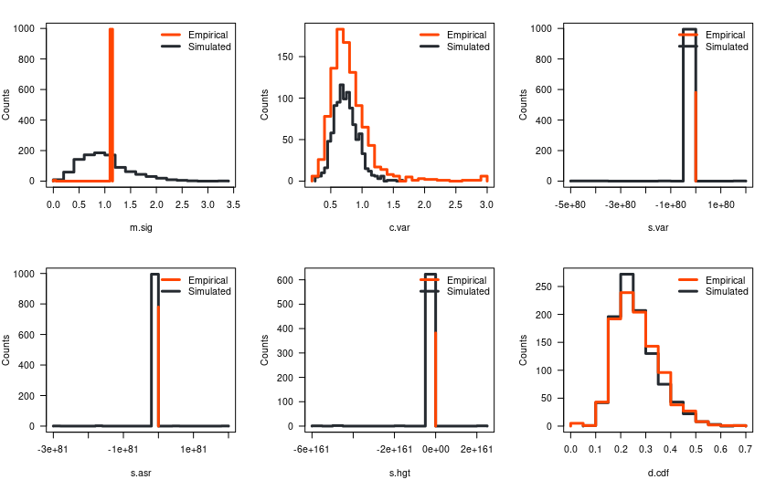
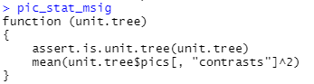
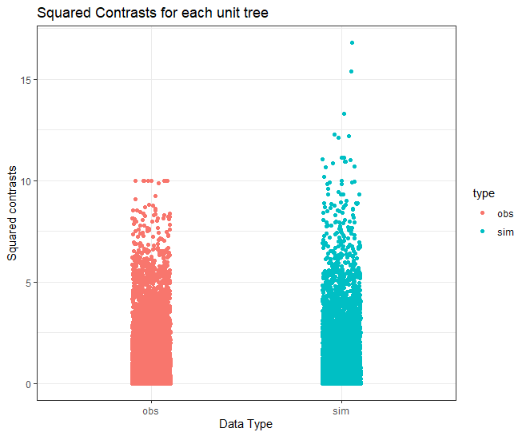
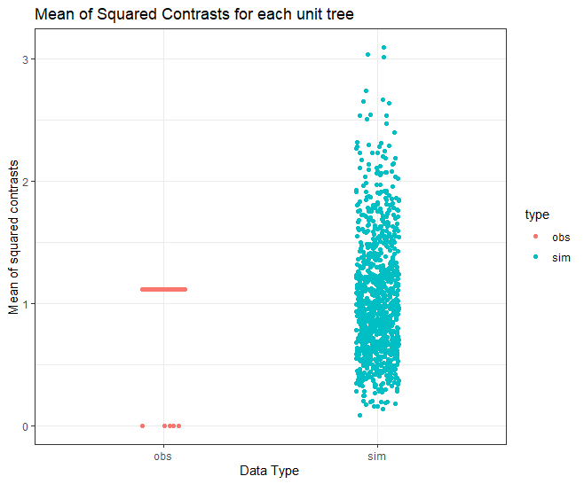

# Debugging s.hgt

## Step 1:

Generate pvals plot for one of the body parts to find where the s.hgt is NA.

## Step 2:

Starting from fit object, run arbutus step by step to see where the NA starts.

## Step 3:

Identify how to stop NA from being NA. Maybe default to some value?

Matts Note: Add error to the fitContinuous function.

Note: Adding error doesn't seem to fix the problem with 100 samples or the full set either.

# Debugging m.sig

## Step 1:

Try simulations. Make simulated tree, simulate data according to OU and fit to OU. Run arbutus step by step. Try list-arbutus as well as individual.

## Step 2:

Compare m.sig values of obs vs simulated. Is there something wrong with the calculation of the p-value for these?

Graph above shows a histogram of the values of each test statistic from my first set of simulations. In this set, the model is adequate. M.sig values of simulated data form a vertical line. Results in the plot below when plotting the p values.

Even when using different trees between each simulation, m.sig still looks like below.

When using inadequate data, m.sig once again showed only one point for empirical, as shown below.

It means the means of all the contrasts is the same. Maybe it is being calculated for only one of the contrasts? Real data shown below.

| m.sig | c.var | s.var | s.asr | s.hgt | d.cdf |
|-------|-------|-------|-------|-------|-------|
| 0.706 | 0.962 | 0.846 | 0.54  | 0.546 | 0.952 |

: P-values for graph above

Notably, in each of these instances the m.sig for the observed data is always tight, around a single value. Specifically, the m.sig always hovers around 1. This explains why m.sig p values are a normal distribution, because you aren't comparing 2 distributions, you are comparing a distribution to a constant! This could be caused by the way m.sig is calculated. The calculation is shown below.

Mean calculation seems correct. Perhaps there is something up with the squared contrasts themselves? Below is a comparison of the squared contrasts values between observed contrasts compared to those simulated by arbutus.

Contrast distribution seemingly the same. However, the means for each unit tree tell a different story.

For whatever reason, the means of the squared contrasts (msig) for the the observed data (exacty same dataset as above) converge to almost exactly 1.11. But the msig for the simulated data vary. Perhaps the contrasts themselves are being incorrectly calculated?
