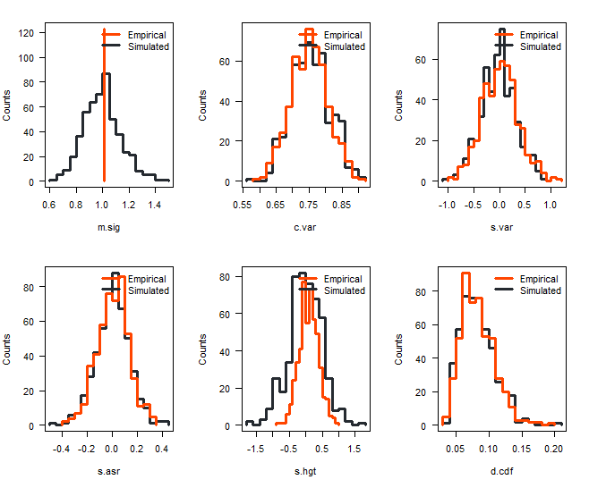
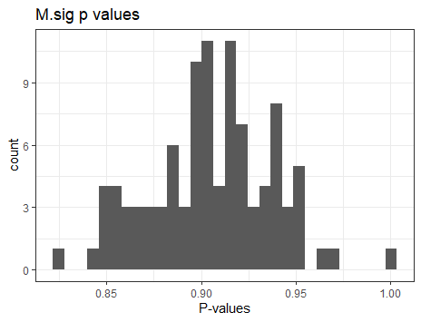
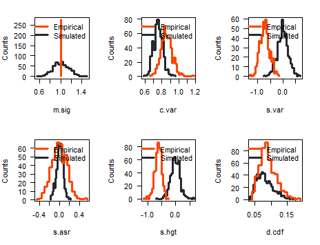

# Debugging s.hgt

## Step 1:

Generate pvals plot for one of the body parts to find where the s.hgt is NA.

## Step 2:

Starting from fit object, run arbutus step by step to see where the NA starts.

## Step 3:

Identify how to stop NA from being NA. Maybe default to some value?

Matts Note: Add error to the fitContinuous function.

Note: Adding error doesn't seem to fix the problem with 100 samples or the full set either. 

# Debugging m.sig

## Step 1:

Try simulations. Make simulated tree, simulate data according to OU and fit to OU. Run arbutus step by step. Try list-arbutus as well as individual.

## Step 2:

Compare m.sig values of obs vs simulated. Is there something wrong with the calculation of the p-value for these?

Graph above shows a histogram of the values of each test statistic from my first set of simulations. In this set, the model is adequate. M.sig values of simulated data form a vertical line. Results in the plot below when plotting the p values.

Even when using different trees between each simulation, m.sig still looks like below.

When using inadequate data, m.sig once again showed only one point for empirical, as shown below.

It means the means of all the contrasts is the same. Maybe it is being calculated for only one of the contrasts? Find these plots again for real data.
