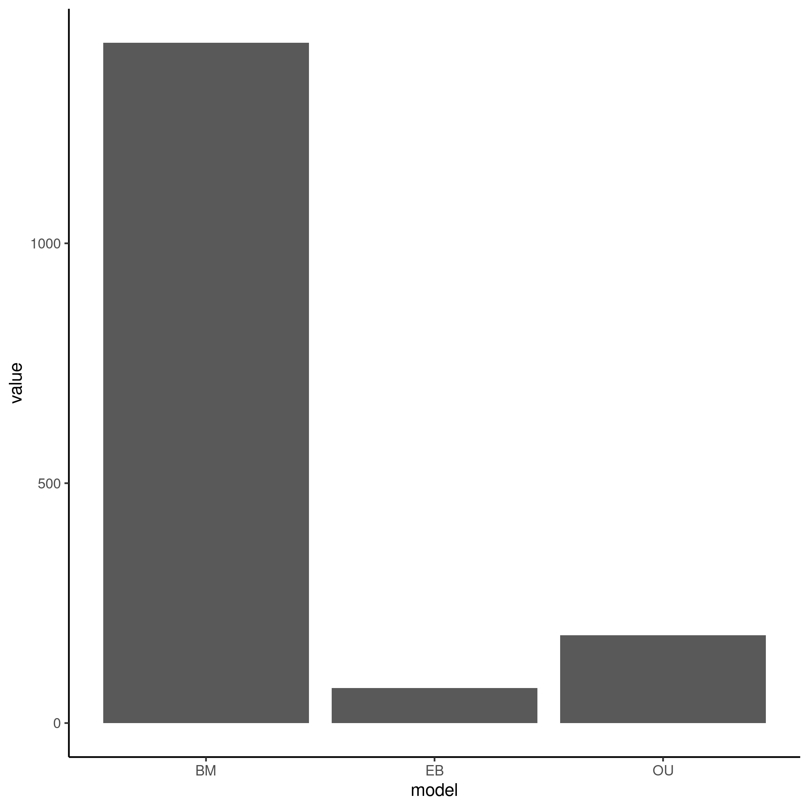

```{r setup, include=FALSE}
knitr::opts_chunk$set(echo = TRUE)
```

# Analysis of Extremophile Fishes Data Adequacy

------------------------------------------------------------------------

## Introduction

The data set is taken from a [paper](https://www.biorxiv.org/content/10.1101/2021.12.13.472416v1.full) studying transcriptomes in gill tissue of a genera of fishes, where 10 of the species have colonized pools high in sulfides. The paper primarily leverages the EVE model (which is an extension of OU) to study gene expression shifts between taxa that live in sulfide-rich waters and those that do not. They found that the degree of "convergence" in gene expression was higher not in species that were closely related, but those that live in similar environments. This suggests that convergent evolution of gene expression is occurring. This analysis aims to uncover if the phylogenetic models at hand are adequate for the data set.

## Summary Analysis

```{r include=FALSE}
library(tidyverse)
pval_files <- list.files("arbutus/pvals/")

readfile <- function(filename){
  res <- readRDS(paste0("arbutus/pvals/", filename))
  res
}

pvals_total <- map_df(pval_files, readfile)

p_df <- pvals_total %>% select(!m.sig) %>% transmute(c.less = c.var <= 0.05, sv.less = s.var <= 0.05, sa.less = s.asr <= 0.05, sh.less = s.hgt <= 0.05 & !is.na(s.hgt), d.less = d.cdf <= 0.05) %>% transmute(inade = c.less + sv.less + sa.less + sh.less + d.less) %>% count(inade) %>% mutate(prop = n/sum(n)) %>% mutate(inade = as.character(inade), sex = "male")

figure1 <- p_df %>% ggplot(aes(x = inade, y = n, fill = inade)) + geom_bar(stat = "identity") + geom_text(aes(label = round(prop, digits = 2))) +
  xlab("Number of inadequacies") + ylab("Number of genes") + labs(tag = "A") + ggtitle("Amount of genes by number of inadequacies without BMS model") + facet_grid(~sex) + theme_bw() 
```

```{r}
figure1
```

**Figure 1: Using the best-fit model (chosen by AIC) shows a low adequacy for the data set, more than half of the data being inadequate in at least one test statistic.**

Overall, the data set shows inadequacies in multiple test-statistics. 20 fish species are included, with 16740 genes overall.

## Results

### Initial Arbutus Analysis




**Figure 2. Relative fit (left) and absolute fit (right) of the data.** Overall, a BM model fits the data the best in a relative sense, and in an absolute sense the best-fit model shows problems in all test statistics except for d.cdf.

After initial analysis, I hypothesized that adding a multi-rate model to the analysis would increase the fit of the data, due to inadequacies in s.asr, s.var, s,hgt, and c.var which were shown to have increased values under 0.05 when the true model is BMS and a single-rate model is fit in my other analysis (Analysis of Multirate models in the Arbutus Exploration folder). In addition, the paper that the data stems from studied rate-shifts between different lineages depending on environment. So my next arbutus analysis will incorporate a BM model where there are different rates depending on if the fish lives in a sulfur-rich environment or not.
