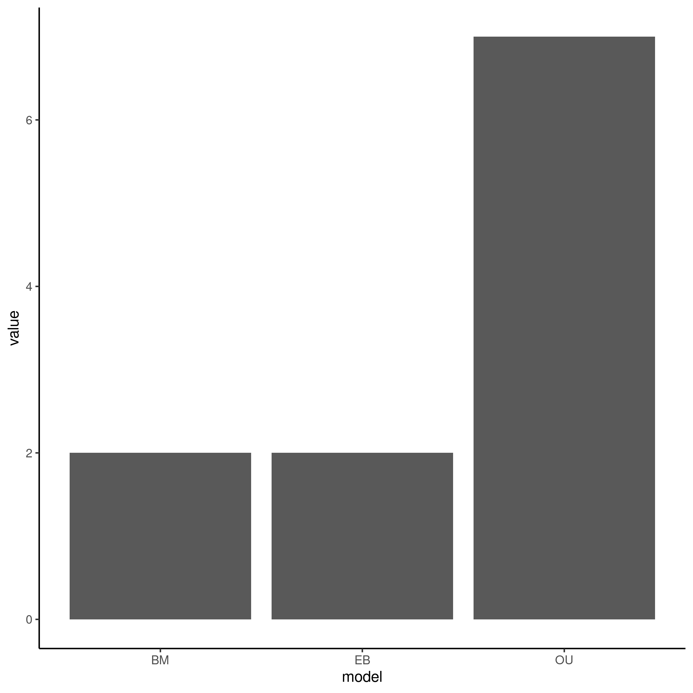
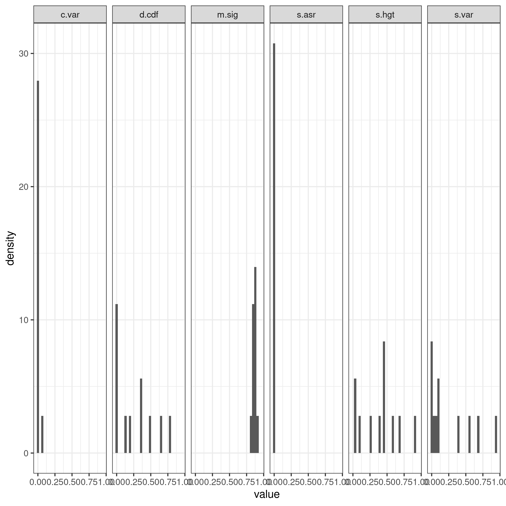
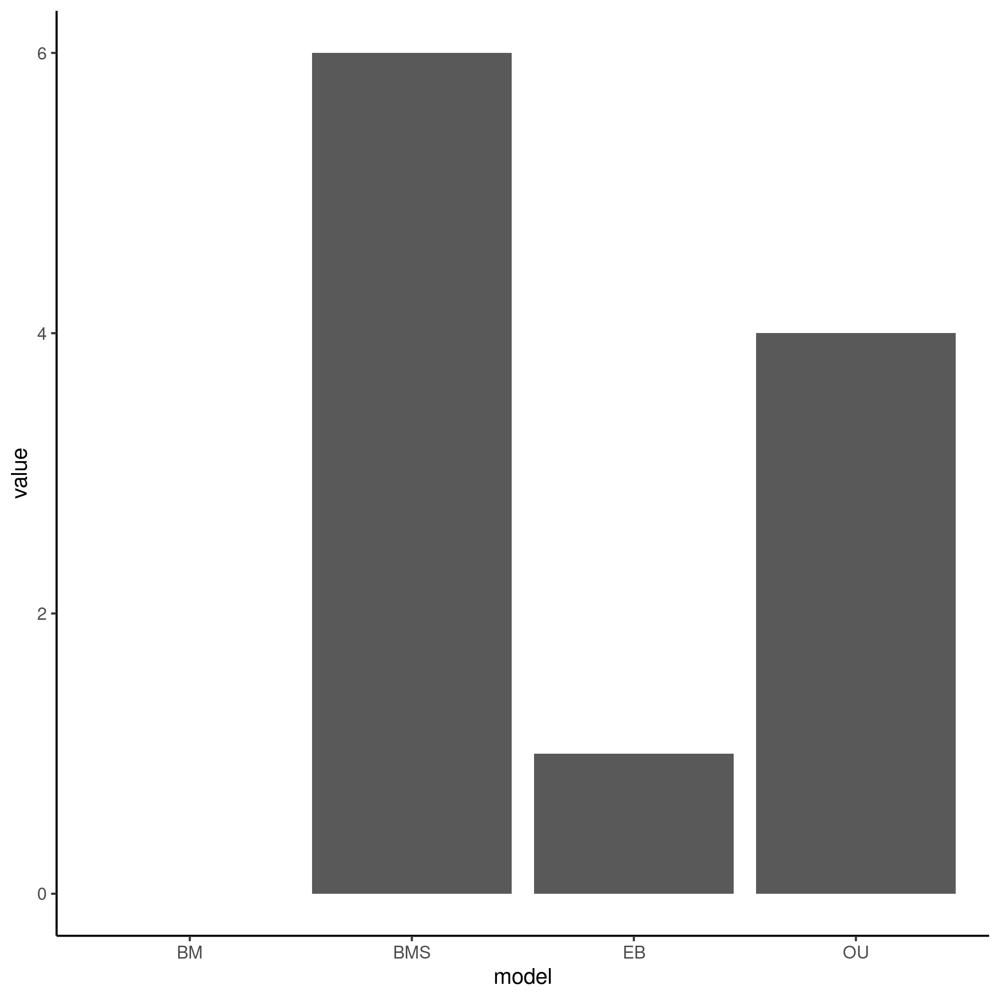
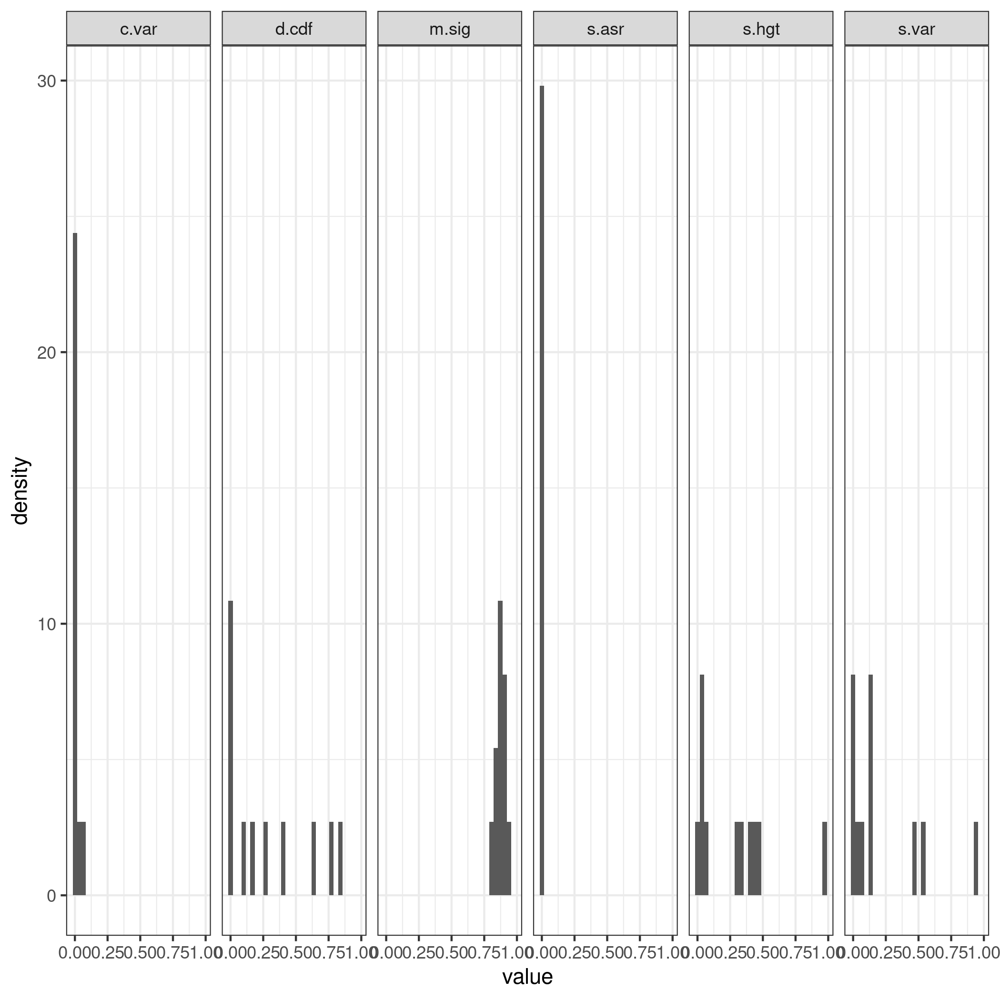

```{r setup, include=FALSE}
knitr::opts_chunk$set(echo = TRUE)
```

# Analysis of Snake Venom Data Adequacy

------------------------------------------------------------------------

## Introduction

The data set for this analysis was taken from a [paper](https://royalsocietypublishing.org/doi/full/10.1098/rspb.2020.0613) studying the expression of snake venom toxins in 52 venomous snakes. The paper aimed to understand the varying evolutionary rates to understand the "tempo" of evolution in adaptive radiations. They found that all toxins undergo rate shifts, and that the Levy process better fits the studied dynamics than either Early Burst, Ornstein Uhlenbeck, or Brownian Motion. They concluded that there was little evidence of snake venom exhibiting features typical of adaptive radiation, and therefore it likely is not heavily influencing such a process. I will be analyzing the data to test the adequacy of EB, OU, or BM models for this data.

## Summary Analysis

```{r, include=FALSE}
library(tidyverse)
pvals <- readRDS("arbutus/pvals")
pvals2 <- readRDS("arbutus/BMS/pvals")

adequacy_single <- pvals %>% select(!m.sig) %>% transmute(c.less = c.var <= 0.05, sv.less = s.var <= 0.05, sa.less = s.asr <= 0.05, sh.less = s.hgt <= 0.05 & !is.na(s.hgt), d.less = d.cdf <= 0.05) %>% transmute(inade = c.less + sv.less + sa.less + sh.less + d.less) %>% count(inade) %>% mutate(prop = n/sum(n)) %>% mutate(model = "w/o BMS")

adequacy_bms <- pvals2 %>% select(!m.sig) %>% transmute(c.less = c.var <= 0.05, sv.less = s.var <= 0.05, sa.less = s.asr <= 0.05, sh.less = s.hgt <= 0.05 & !is.na(s.hgt), d.less = d.cdf <= 0.05) %>% transmute(inade = c.less + sv.less + sa.less + sh.less + d.less) %>% count(inade) %>% mutate(prop = n/sum(n)) %>% mutate(model = "w/ BMS")

adequacy <- full_join(adequacy_single, adequacy_bms)

figure1 <- adequacy %>% ggplot(aes(x = inade, y = n, fill = inade)) + geom_bar(stat = "identity") + geom_text(aes(label = round(prop, digits = 2))) +
  xlab("Number of inadequacies") + ylab("Number of genes") + ggtitle("Amount of toxins by number of inadequacies in snake venom") + facet_wrap(~model) + theme_bw() 
```

```{r, echo=FALSE}
figure1
```

**Figure 1. Most genes show inadequacies in 3 or less test statistics.** No genes have no inadequacies. Addition of multi-rate BM models reduced the inadequacy of one gene.

Overall the best-fit model is not adequate for the data.

## Results





**Figure 2. Relative fit (left) and absolute fit (right) of the toxin genes.** Most test statistics show a left-skew; suggesting inadequacies. Most notable are c.var and s.asr; test statistics often violated when the true model has multiple rates.

The fact that rate variation seems to be violated here when using single-rate models, suggests that the authors of the study were correct in using models that allow rate to change, such as the Levy "pulsed rate" model.

I then added multiple-rate BM models to my analysis to see if that could alleviate the inadequacies shown here. Evolutionary regimes were determined by first running the Motmot package to detect rate shifts. The adequacy results are shown below.





**Figure 3. Relative fit (left) and absolute fit (right) of the toxin genes when adding BMS model to analysis.** Most test statistics show a left-skew; suggesting inadequacies. Most notable are c.var and s.asr; test statistics often violated when the true model has multiple rates. There is one less inadequacy in c.var.

As shown in Figure 1 and Figure 3, addition of the BMS model to my analysis only slightly reduced the inadequacies shown from rate heterogeneity. This suggests other factors may be causing the best-fit models to not adequately explain the variation in the data.
